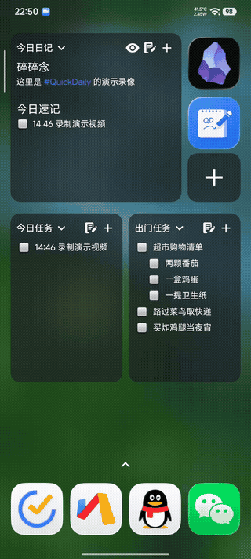

<p align="center">
  <a href="#english">English</a> · <a href="#简体中文">简体中文</a>
</p>

---

<a id="english"></a>

## English

<h3 align="center">QuickDaily — Obsidian Quick Notes · Android Widgets</h3>

<p align="center">
  <b>Take out your phone → open the widget instantly → save a quick note to your vault → put it away</b>
</p>

<p align="center">
  <a href="https://github.com/agarcabin/QuickDaily/releases">
    
  </a>
  <a href="https://github.com/agarcabin/QuickDaily/releases">
    
  </a>
  <a href="https://www.coolapk.com/u/400522">
    
  </a>
</p>

<p align="center">
  
  
  
  
</p>

---

### Demo screenshots

<p align="center">
  
</p>

<p align="center">Recorded with QD v1.9.1 · 2026/08/29</p>

<p align="center">
  
</p>

<p align="center">Recorded with QD v1.0.0 · 2026/05/29</p>

---

### Why QuickDaily?

**Obsidian Mobile is great, but it takes too long to start.** By the time it finishes loading, the idea is gone.

QuickDaily does one thing: **help you capture a thought for today as quickly as possible**.

- Reads and writes your Obsidian vault diary files directly in the background
- Cold-starts in **< 500 ms** and opens directly to today's diary
- Save, lock your phone, and put it away — everything is saved automatically

---

### Features at a glance

| | |
|---|---|
| **⚡ Instant launch** — open and start writing; cold start < 500 ms | **🧩 Seamless Obsidian integration** — reads diary configuration, paths, and templates automatically |
| **📑 Markdown rendering** — supports headings, lists, task checkboxes, bold/italic text, and links | **💾 Real-time saving** — debounced 500ms writes and immediate background saving |
| **🏠 Home-screen diary widget** — browse the full diary for today | **🪟 Floating quick capture** — a 1x1 widget opens a transparent floating note window |
| **📥 Task entry** — task mode in the floating window, with double-tap completion | **🖼️ Image capture** — batch-import images from the floating window into your diary |
| **📆 Flexible date formats** — includes week-number date formats | **🔍 Frontmatter filtering** — optionally hide diary frontmatter and focus on the content |
| **🔖 Quick-note anchor** — configure anchor text and insert notes at a specified position | **🎯 Today task widget** — view and check off tasks directly from the home screen |

---

### More features

| | |
|---|---|
| 🖍️ **Timestamps** — 7 configurable formats, compatible with Thino / Knomo | ⏱️ **Quick Settings tile** — capture a note from the notification shade |
| 📱 **Launcher shortcuts** — create a shortcut from the launcher | 🎨 **Material 3 theme** — Android 15 edge-to-edge support |
| 🖼️ **Custom widget images** — customize the diary widget background | 🔄 **Automatic update checks** — check for new GitHub versions at startup |

---

### Demo video

🎬 [Watch the demo video on Bilibili](https://www.bilibili.com/video/BV1smTm6wE4t/)

---

<a id="简体中文"></a>

## 简体中文

<h3 align="center">QuickDaily — Obsidian 闪念速记 · Android 小部件</h3>

<p align="center">
  <b>掏出手机 → 小部件秒开 → 速录一键保存至 Obsidian 库 → 放回口袋</b>
</p>

<p align="center">
  <a href="https://github.com/agarcabin/QuickDaily/releases">
    
  </a>
  <a href="https://github.com/agarcabin/QuickDaily/releases">
    
  </a>
  <a href="https://www.coolapk.com/u/400522">
    
  </a>
</p>

<p align="center">
  
  
  
  
</p>

---

### 演示截图

<p align="center">
  
</p>

<p align="center">录制于 QD v1.9.1 · 2026/08/29</p>

<p align="center">
  
</p>

<p align="center">录制于 QD v1.0.0 · 2026/05/29</p>

---

### 为什么需要 QuickDaily？

**Obsidian 移动端什么都好，就是启动太慢了。** 等它加载完，灵感早飞了。

QuickDaily 只做一件事：**让你用最快的速度记下今天的一句话**。

- 它在后台直接读写 Obsidian 库中的日记文件
- 冷启动 **< 500ms**，打开就是今天的日记
- 写完了直接锁屏放回口袋，一切自动保存

---

### 功能一览

| | |
|---|---|
| **⚡ 秒开** — 打开即写，冷启动 < 500 ms | **🧩 Obsidian 无缝集成** — 自动读取日记配置、路径、模板 |
| **📑 Markdown 渲染** — 标题、列表、任务勾选、粗斜体、链接均支持 | **💾 实时保存** — 防抖 500ms 自动写入，切后台立即落盘 |
| **🏠 桌面便签小部件** — 自适应大小，主屏浏览今日日记全文 | **🪟 快速添加悬浮窗** — 1x1 小部件，弹出透明悬浮窗一键速记 |
| **📥 任务录入** — 悬浮窗支持任务模式，双击切换完成状态 | **🖼️ 图片录入** — 支持从悬浮窗批量导入图片到日记 |
| **📆 全日期格式支持** — 新增周数日期格式支持 | **🔍 Frontmatter 过滤** — 可选隐藏日记文件头，专注内容 |
| **🔖 速记锚点** — 自定义锚点文本，自动插入指定位置 | **🎯 今日任务小部件** — 桌面直接查看/勾选待办任务 |

---

### 更多特性

| | |
|---|---|
| 🖍️ **时间戳** — 7 种格式可配置，兼容 Thino / Knomo | ⏱️ **快捷磁贴** — 下拉通知栏一键速记 |
| 📱 **桌面快捷图标** — 长按按钮一键创建桌面图标 | 🎨 **Material 3 主题** — Android 15 Edge-to-Edge |
| 🖼️ **自定义小部件图片** — 桌面便签自定义背景 | 🔄 **自动检测更新** — 启动时检测 GitHub 新版本 |

---

### 演示视频

🎬 [点击观看演示视频 (Bilibili)](https://www.bilibili.com/video/BV1smTm6wE4t/)

---

### 下载

> [前往 GitHub Releases 下载最新版](https://github.com/agarcabin/QuickDaily/releases)

| 渠道 | 链接 |
|------|------|
| GitHub Release | [下载 APK](https://github.com/agarcabin/QuickDaily/releases) |
| 蓝奏云（国内分流） | [点此下载](https://github.com/agarcabin/QuickDaily/releases) (密码: fjdr) |
| 酷安社区 | [@附近的人](https://www.coolapk.com/u/400522) |
| QQ 交流群 | [1050092886](https://qm.qq.com/q/G2zLL5RpiU) — Obsidian 许愿屋 |

---

### 打赏

如果你觉得对你很有帮助的话，请我喝杯咖啡吧~

<p align="center">
  
</p>

---

### 技术栈

| 技术 | 版本 |
|------|------|
| Kotlin | 1.9.24 |
| Jetpack Compose | BOM 2024.09.00 |
| Material 3 | Material Design 3 |
| AGP | 8.2.0 |
| Gradle | 8.4 |
| minSdk | 26 (Android 8.0) |
| targetSdk | 35 (Android 15) |
| 架构 | MVVM + Compose + Coroutines |

---

### 构建

```bash
git clone https://github.com/agarcabin/QuickDaily.git
cd QuickDaily
./gradlew assembleRelease
```

需要 Android SDK 35+，在 `local.properties` 中配置 `sdk.dir`。

---

### 许可

MIT License — 详见 [LICENSE](LICENSE)
